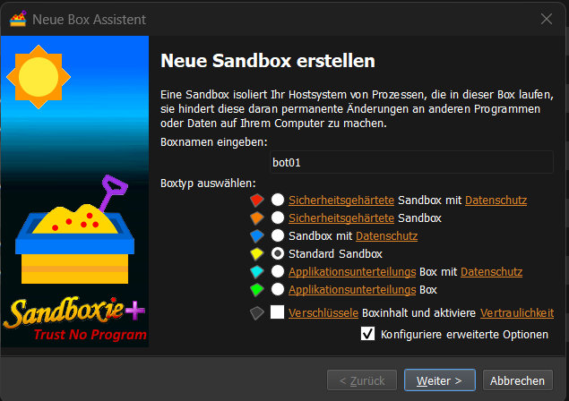
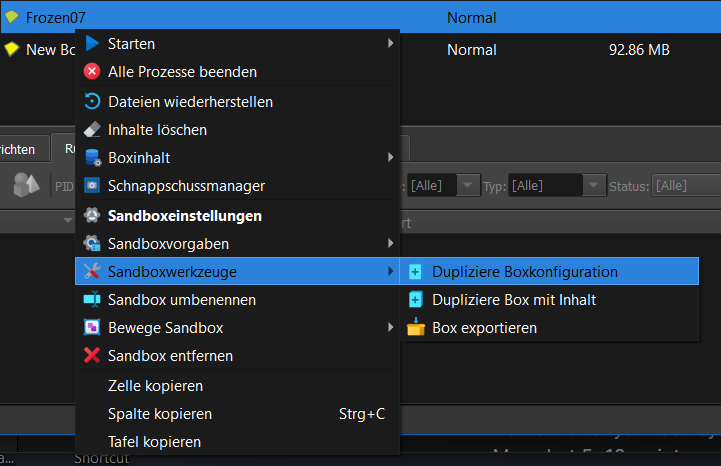
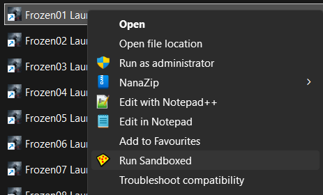
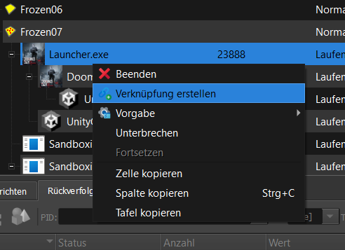
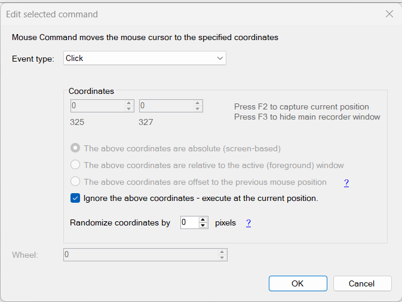
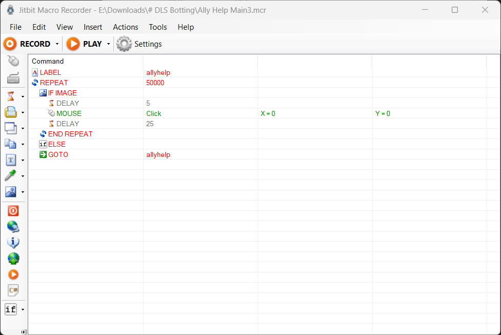
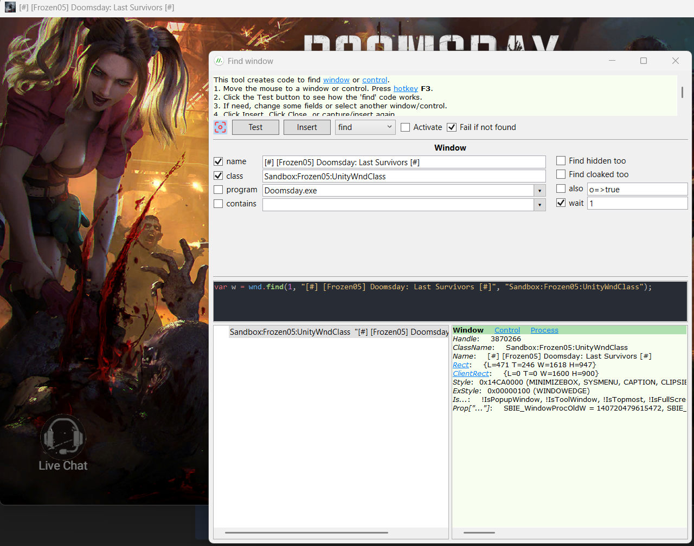

> [!todo] Konto Verwaltung

Wir benötigen eine email adresse pro Konto. 
Einfachste lösung, mit Gmail. Einfach die mail mit ein plus "+" ergänzen, und beliebige bezeichnung.  "+bot01"

thehairymuffin@gmail wird zu
thehairymuffin+bot01@gmail.com
Erstelle so viele wie nötig.

Falls namen/vorname für die Kontos benötigt werden, werde kreativ, alternativ
[hier](https://www.fakenamegenerator.com/gen-random-gr-gr.php) lassen sich namen erstellen.

Speicher die addressen und passwörter irgendwo.

> [!success] Konto Verwaltung Abgeschlossen.

> [!todo] PC Client einrichtung

> [!todo]- Als anhaltspunkt, meine hardware, damit kriege ich 10 bots hin.
i7 6700K @ 4.2Ghz 4C/8T
16GB DDR4 RAM 2600
500GB nvme SSD
10 bots maximum

PC Client runterladen, installieren.
Installationsordner "Doomsday" kopieren
Und mehrmals einfügen für anzahl von bots
Umbenennen, "bot01, bot02" usw.

> [!warning] Bei spiel Update
Wenn update verfügbar, nur ein client aktualisieren.
In dem aktualisierten ordner gehen, und den ordner mit der neuen version kopieren und bei jedem weiteren bot einfügen.
Beispiel "1.45.0" kopieren, einfügen.
Alte version "1.43.2" in allen ordnern löschen.
Anschliessend alle bots mal starten.

> [!success] PC Client einrichtung Abgeschlossen.

> [!todo] Sandboxie Plus
[Download from github](https://github.com/sandboxie-plus/Sandboxie/releases/tag/v1.15.12 )

Benötigen wir um die bots voneinander akzukapseln, mit eigenem gespeichertem login. Sonst müsste man jedesmal, bei jedem bot, email und passwort eingeben.

Sandboxie installieren, öffnen...

Erstelle eine neue Sandbox, alle standard Einstellungen, immer weiter klicken.
Nutze einfachen Namen wie "bot01", wir benutzen diesen namen später in LibreAutomate.
  
Nach der erstellung, rechts-click auf bot01, und folgende einstellungen vornehmen:
![[sandbox3 1.png]]
Für jeden bot, box duplizieren:
  
Und natürlich umbenennen; bot02, bot03, bot04....

Bei diesem schritt musst du schnell sein: mit rechts-click den doomsday launcher über sandboxie laufen:
  
Sobald der launcher läuft
Schnell rechts-click auf den Launcher.exe im sandboxie hauptfenster und Verknüpfung erstellen.
  
Das ist der shortcut, der den Bot startet, ohne die lästige konto eingaberei.

Wiederholen für jeden Bot.
Launcher02 mit sandbox 02, Launcher03 mit sandbox03 usw.

> [!success] Sandboxie einrichtung Abgeschlossen.

> [!todo] Jitbit Macro Recorder
[Download basic version from Jitbit](https://www.jitbit.com/macro-recorder/)

Benötigen wir für die bilder erkennung, und automatisches klicken.

Mit folgendem daten bekommt man die vollversion von Macro Recorder.
> [!NOTE] Username/Serial Key
> `On HAX`
> `ENokcYSKQS1XsrhrqKC6j+ieiSJkwolCD9ZBFro59VlmwKz/J4AfCP7+`

Installiere und starte Macro Recorder (schalte vollversion frei)

1. Insert > LABEL > allyhelp (Label wird benötigt für unendlich loop)
2. Insert > REPEAT X TIMES > Repeat 500000
3. Insert > If Image Found > Capture (Hilfe knopf eingrenzen)
![[IF IMAGE.png]]
4. Insert > Delay 5ms
5. Insert > Mouse Command
  
6. Delay 25ms
7. Insert > REPEAT X TIMES > END REPEAT
8. Insert > IF > ELSE
9. Insert > GOTO > allyhelp

Fertiges auto-clicker script sieht dann so aus:
  

Speichern nicht vergessen!

**Strg+Space** - startet und pausiert das skript.

Macro Recorder einrichtung Abgeschlossen.

LibreAutomate
[Official page](https://www.libreautomate.com/ )

Benötigen wir um die bot fenster zu verkleinern. Der PC client lässt keine kleinere lösung zu als im spiel einstellbar.
Used for resizing and moving the bot windows.
Could also be used as auto clicker, but honestly, I'm too stupid, haven't got it working yet, if I could, it would completely replace Macro Recorder.

Installiere und starte LibreAutomate
Ersten Bot hochfahren.
Warten bis geladen.
Zeige über dem fenster, und drücke Strg+Shift+W
Folgendes fenster öffnet sich:
Notiere die zwei werte "name" und "class"
  

Create new script
Name it after your bot layout
Move bot 5x10.script

Simple variable to find named window (use the naming scheme assigned in sandboxie), make it active (activate), resize and finally reposition it.

> [!NOTE] Caveat
> The PC client simply won't allow a smaller resize than the lowest in game resolution (58px730), so we need to force resize the window.

~~~C#
var w1 = wnd.find(5, "[#] [Frozen05] Doomsday: Last Survivors [#]", "Sandbox:Frozen05:UnityWndClass").Activate();
w1.Activate();
w1.Move(-4, 676, workArea: true);
w1.Resize(648, 490);

var w1 = wnd.find(5, "[#] [bot01] Doomsday: Last Survivors [#]", "Sandbox:bot01:UnityWndClass").Activate();
w1.Activate();
w1.Move(-4, 676, workArea: true);
w1.Resize(648, 490);
~~~

And repeat for each bot, sequential, w2, w3 etc

> [!DANGER] Complete first time setup before continuing
> Start with Bot 01
> Use sandboxie shortcut
> Wait till opens
> Click shit away
> Run script. 
> `Windows resize and move into place`

Repeat for all bots

(To-do: auto click on window at start, automate alliance donations/gifts/mails,)

Once all bots running, resized and positioned, CTRL-Space to start auto click.
Profit.

**First time setup after initial install**
Create a folder on desktop.
Create shortcut for each bot, launcher01.exe
Create shortcuts for:
Macro Recorder
LibreAutomate
Sandboxie

After initial setup, all you have to do is:
Start Macro Recorder (open clicker script)
and Libre Automate (scripts always open-auto save)
Sandboxie runs in the background 

Start up each bot one by one
Wait till open and clickable
`optional`Donate/Collect gifts/rss/Claim mails
When max amount open
Run LibreAutomate script
Press Ctrl-Space to start auto clicker

## To do list
In game. Try and automate the first few levels, until able to join alliance.

For window sizes and positions, here a few example layouts:
INSERT IMAGE
